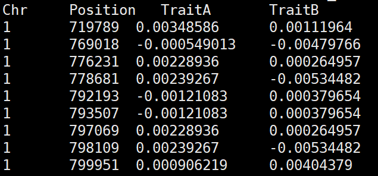
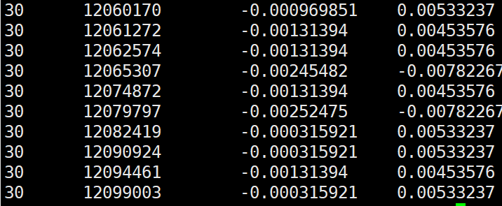

# Correlation Scan

Correlation scan is a statistical framework developed to estimate local genetic correlations between two traits based on fixed window size in a fixed sliding window. The framework uses BLUP solution of SNP effects to estimate these local genetic correlations. In addition, correlation scan can identify drivers and antagonizing regions affecting trait correlations; for the driver regions,the local correlation estimate has the same direction, positive or negative, as the global genetic correlation; in antagonizing windows it is the opposite. For more details, see the [Correlation Scan paper](https://doi.org/10.1101/2021.11.05.467409).

## Requirements
The software is developed using [Perl language](https://www.perl.org/get.html) and has been tested in Linux, Windows and Mac OS environments.

## Tutorial
The tutorial will show you how to download and run Correlation Scan 

You can download Correlation scan by:

```
$ git clone https://github.com/optimist0372/Correlation-Scan/
$ cd ./Correlation-scan
```

### Input data format
Note:  example data are provided in **example_data** folder.

Correlation scan only requires **one input file**

This input file should contain four (4) Columns:

1. `Chr`: Chromosome number of each SNP effect
2. `Position`: Chromosome position of each SNP effect
3. `TraitA`: BLUP solution of SNP effects for trait A
4. `TraitB:` BLUP solution of SNP effects for trait A

**Here is a typical header of the input file**



If you chromosome contain sex chromosome (e.g. X), the X chromosome should be; (autosome number +1).
For example, for *bos* taurus with 29 autosomes, the X chromosome will be 30.




