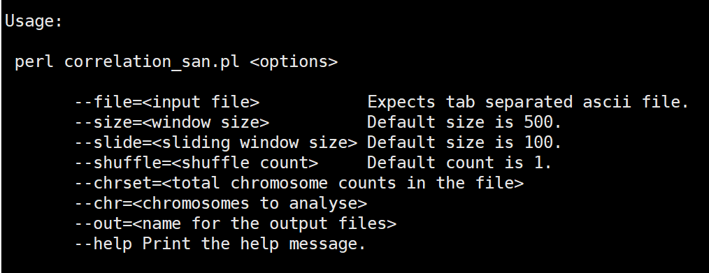

# Correlation Scan

Correlation scan is a statistical framework developed to estimate local genetic correlations between two traits based on fixed window size in a fixed sliding window. The framework uses BLUP solution of SNP effects to estimate these local genetic correlations. In addition, correlation scan can identify drivers and antagonizing regions affecting trait correlations; for the driver regions,the local correlation estimate has the same direction, positive or negative, as the global genetic correlation; in antagonizing windows it is the opposite. For more details, see the [Correlation Scan paper](https://doi.org/10.1101/2021.11.05.467409).

## Requirements
The software is developed using [Perl language](https://www.perl.org/get.html) and has been tested in Linux, Windows and Mac OS environments.
Donwload Perl [here](https://www.perl.org/get.html) for your operating system.

## Tutorial
The tutorial will show you how to download and run Correlation Scan 

You can download Correlation scan by:

```
$ git clone https://github.com/optimist0372/Correlation-Scan/
$ cd ./Correlation-scan
```

### Input Data Format
`Note`:  Example data are provided in **example_data** folder.

Correlation scan only requires **one input file**. This input file should contain four (4) Columns:

1. `Chr`: Chromosome number of each SNP effect
2. `Position`: Chromosome position of each SNP effect
3. `TraitA`: BLUP solution of SNP effects for trait A
4. `TraitB:` BLUP solution of SNP effects for trait A

**Here is a typical header of the input file**


If you chromosome contain sex chromosome (e.g. X), the X chromosome should be; (autosome number +1).
For example, for *bos* taurus with 29 autosomes, the X chromosome will be 30.


## How to Run Correlation Scan

To run correlation scan, you can first use the *--help* command to get an overview about the built-in commands and their description

```
$ perl script/correlation_scan.pl --help

```



Now that you have an overview of command-line arguments and their explanation, you may run the following command:

### Runinng Correlation Scan for a Single Chromosome (e.g. 1)
```
$ perl script/correlation_scan.pl --file example_data/sample.txt --size 500 --slide 100 --shuffle 1000 --chrset 30 --chr 1 --out toy 

```
### Runinng Correlation Scan for some Specified Chromosomes (e.g. 1,4,5,10 and 20)
```
$ perl script/correlation_scan.pl --file example_data/sample.txt --size 500 --slide 100 --shuffle 1000 --chrset 30 --chr 1,4-5,10,20 --out toy

```
### Runinng Correlation Scan for the Whole Chromosomes (e.g. 1 to 30)
```
$ perl script/correlation_scan.pl --file example_data/sample.txt --size 500 --slide 100 --shuffle 1000 --chrset 30 --chr 1-30 --out toy
```

## Explanation of Outputs files

Correlation scan produce two (2) output files based on user defined output name (i.e., toy)

### 1. toy.res

The toy.res file is a tab delimited file consisting of the following colums:

 * `Window`: The window number.
 * `Chr`: The chromosome number.
 * `Start`: The start position of the local genomic region.
 * `End`: The end position of the local genomic region.
 * `r`: The local genetic correlation estimate.
 * `pvalue`:The p value of local genetic correlation.
 * `perm_avg`: The mean of the the permuted local genetic correlation for *n* number of interations (i.e. shuffle).
 
### 2. toy.chc
This is a tab delimited file consisting of the following colums
 * `Chr`:The chromosome number.
 * `No_of_SNP`: The number of SNPs per chromosome
 * `No_of_window`: The number of windows per chromosome
 
